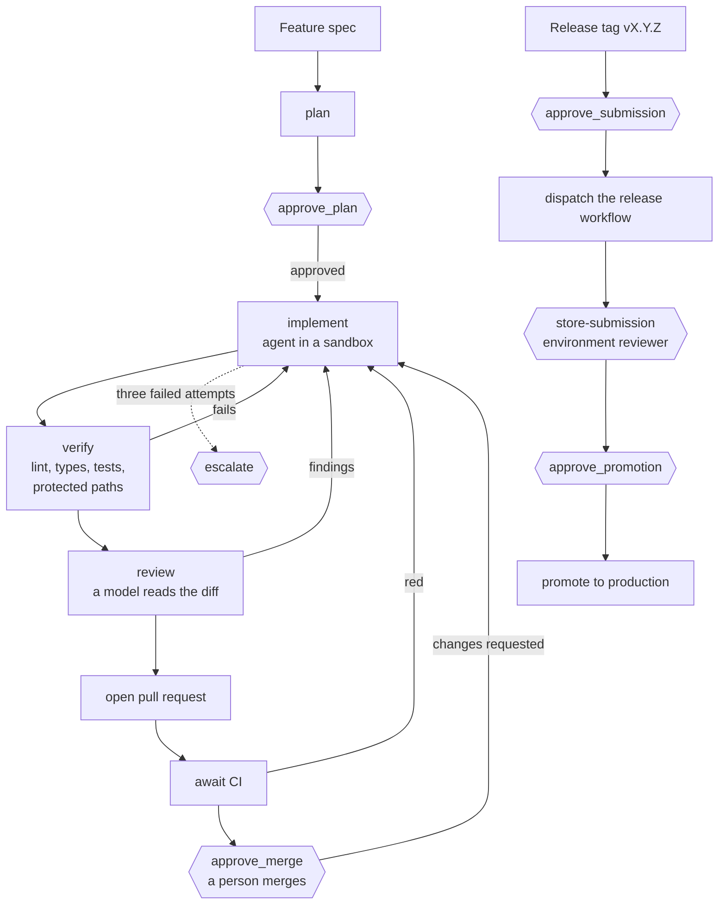

# ai-mobile-app-factory

[](https://github.com/jmcoimbra/ai-mobile-app-factory/actions/workflows/ci.yml)
[](LICENSE)

An agent-driven factory that takes a feature spec to a reviewed pull request,
and a release tag to an app store, with a person approving every step that
matters.

It has two parts:

- **The factory**, a [LangGraph](https://langchain-ai.github.io/langgraphjs/)
  graph in TypeScript. It plans a feature from a spec, writes the code and
  the tests in an isolated workspace, checks them, reviews them, opens a pull
  request and, for a release, dispatches the store submission. It stops for a
  person at five points. It never merges, and it never holds a store key.
- **The reference app**, a React Native + Expo app that the factory builds and
  ships. It comes in two flavors from one codebase: a public store app, and a
  corporate app for the staff of one organization that stays out of public
  store search.

The reference feature, a daily store checklist for restaurant managers, is
written by the factory from [`specs/daily-checklist.md`](specs/daily-checklist.md),
in a pull request of its own.

## How the factory works



The hexagons are where a person decides. Three rules hold the design together:

1. **A side effect lives in the node after its approval.** LangGraph restarts a
   node from its first line when it resumes, so an upload placed before an
   `interrupt` would run twice.
2. **An approval in the graph records intent. It does not unlock credentials.**
   Store keys live in a protected GitHub environment and reach only the upload
   job, after a reviewer approves that job in GitHub
   ([ADR 0008](docs/adr/0008-store-credentials-behind-a-protected-environment.md)).
3. **Model output is untrusted input.** The agent works through four tools
   (read, write, list, run an allowlisted script). They refuse paths outside
   the workspace and the files that execute at build time. Protected paths are
   checked by the tool, again on the diff, and again on the staged files
   before the commit.

Two agent backends are included: LangChain's `createAgent`, with any model
LangChain supports, and Claude Code in headless mode, with its own tools off
and only the factory's MCP server allowed. Both use the same tools and the
same policy.

## What is in the repository

| Path                       | What it holds                                                                                  |
| -------------------------- | ---------------------------------------------------------------------------------------------- |
| `factory/`                 | The graph, its nodes, the sandbox, the MCP tool server, the CLI                                |
| `apps/reference/`          | The Expo app: routes, features, Maestro flows, Fastlane lanes                                  |
| `packages/design-tokens/`  | Colours, type, spacing, light and dark themes, a swappable brand, WCAG contrast checks         |
| `packages/error-contract/` | RFC 9457 problem details, error codes, the user message catalog, retry for idempotent requests |
| `packages/telemetry/`      | A telemetry port with a PII guard, and Sentry-protocol and OTLP adapters                       |
| `packages/app-version/`    | Release tag to `version`, `buildNumber` and `versionCode`                                      |
| `specs/`                   | Feature specs the factory consumes                                                             |
| `docs/`                    | The project spec, the architecture decisions and the runbooks                                  |
| `.github/`                 | CI, release-please, the release workflow and the branch ruleset                                |

## Quick start

Requirements: Node 24 and npm. Device builds need Xcode 26 or Android Studio
with JDK 17, and the end-to-end flows need the Maestro CLI.

```bash
npm ci
npm run lint && npm run typecheck && npm test

# Run the app in a development build
cd apps/reference
npx expo run:ios                              # or: npx expo run:android
APP_VARIANT=corporate npx expo run:android    # the corporate flavor
```

Run the factory on a spec. It needs `git` and `gh` signed in, plus either an
API key for the model the LangChain backend uses, or Claude Code for the other
backend:

```bash
npm run factory -w @maf/factory -- feature specs/daily-checklist.md --backend claude-code
# It stops at the plan. Read it, then answer:
npm run factory -w @maf/factory -- resume <thread> --approve --by <your name>
```

Run the factory inside a disposable VM or container. The tests the agent
writes execute as your user. The factory keeps your tokens out of their
environment, but it cannot stop code from reading a file your user can read.
[`factory/README.md`](factory/README.md) has the details.

## The reference app

- **Two flavors, one codebase.** `APP_VARIANT` picks `public` or `corporate`.
  Each flavor has its own bundle identifier, name, icon, brand and keys, and
  an unknown flavor fails the build.
- **Versions come from the tag.** release-please keeps a release pull request
  open, with the changelog built from Conventional Commits. Merging it tags
  `vX.Y.Z`, and the three version fields derive from that tag. Nobody edits a
  version by hand ([ADR 0004](docs/adr/0004-versioning-from-tags.md)).
- **Errors have one contract.** The API speaks RFC 9457 problem details. A
  person reads a message from a catalog keyed by error code, never the
  technical detail. Only idempotent requests are retried, with backoff
  ([ADR 0007](docs/adr/0007-error-contract-problem-details.md)).
- **Telemetry carries no personal data.** Attributes outside an allowlist are
  dropped, and free text is not sent by default. With nothing configured, the
  app sends nothing. The backend is swappable: any Sentry-protocol server for
  crashes, any OTLP receiver for traces and events
  ([ADR 0005](docs/adr/0005-telemetry-port-and-adapters.md)).
- **Accessible by default.** Every text and surface pair is tested for WCAG AA
  contrast, in both themes and both brands. Interactive elements carry a role
  and an accessible name, and touch targets are at least 48 points.

## Shipping to the stores

| Flavor      | Android                         | iOS                               |
| ----------- | ------------------------------- | --------------------------------- |
| Public      | Google Play                     | App Store                         |
| Corporate   | Managed Google Play private app | Custom app through Apple Business |
| Pre-release | Play internal testing           | TestFlight                        |

Builds and submissions go through Fastlane on top of `expo prebuild`
([ADR 0002](docs/adr/0002-build-and-submission-fastlane.md)). Build and upload
are separate jobs, so code from the repository never runs next to a store key.
Without the operator flag a release run is a dry run: it builds, signs with a
throwaway key, and uploads nothing.
[ADR 0006](docs/adr/0006-distribution-paths.md) compares the official
distribution paths, citing the vendor page read for each claim, and
[the runbook](docs/runbooks/first-store-submission.md) covers the first real
submission. Every release after the first follows
[the release runbook](docs/runbooks/cutting-a-release.md), including the CI
approval GitHub asks for on release pull requests.

## Quality gates

Every pull request runs lint, type checks, unit and component tests, Maestro
flows on an Android emulator, and preview builds for both platforms. The iOS
simulator flows run too, and report without blocking. A ruleset on `main`
blocks the merge until the required checks pass, and allows squash merges
only. Each acceptance criterion in a spec is the exact name of a test, and the
factory refuses a spec whose criteria carry no test name.

## Decisions

| ADR                                                                       | Decision                                                                           |
| ------------------------------------------------------------------------- | ---------------------------------------------------------------------------------- |
| [0001](docs/adr/0001-orchestration-langgraph-typescript.md)               | LangGraph in TypeScript orchestrates the factory                                   |
| [0002](docs/adr/0002-build-and-submission-fastlane.md)                    | Fastlane builds and submits, chosen over EAS and over hand-written store API calls |
| [0003](docs/adr/0003-e2e-maestro.md)                                      | Maestro runs the on-device tests, chosen over Detox                                |
| [0004](docs/adr/0004-versioning-from-tags.md)                             | Versions derive from SemVer tags created by release-please                         |
| [0005](docs/adr/0005-telemetry-port-and-adapters.md)                      | Telemetry goes through a port with swappable adapters                              |
| [0006](docs/adr/0006-distribution-paths.md)                               | The store path for each flavor                                                     |
| [0007](docs/adr/0007-error-contract-problem-details.md)                   | RFC 9457 problem details is the error contract                                     |
| [0008](docs/adr/0008-store-credentials-behind-a-protected-environment.md) | Store credentials live behind a protected GitHub environment                       |

## Not in this version

A real store submission (the lanes exist and run dry), the Apple Developer
Enterprise Program, sign-in, a real backend, over-the-air updates, push
notifications, and a hosted deployment of the graph. The full list is in
[the spec](docs/spec/0001-factory-and-reference-app.md).

## Contributing

Read [`AGENTS.md`](AGENTS.md) first. It holds the rules for people and coding
agents alike: the spec governs, each acceptance criterion is a test name,
commits follow Conventional Commits, and nothing reaches a store without a
person approving it.

## License

MIT. See [LICENSE](LICENSE).
